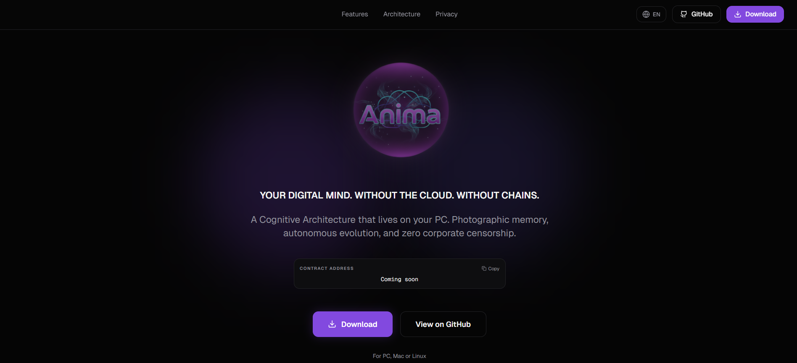
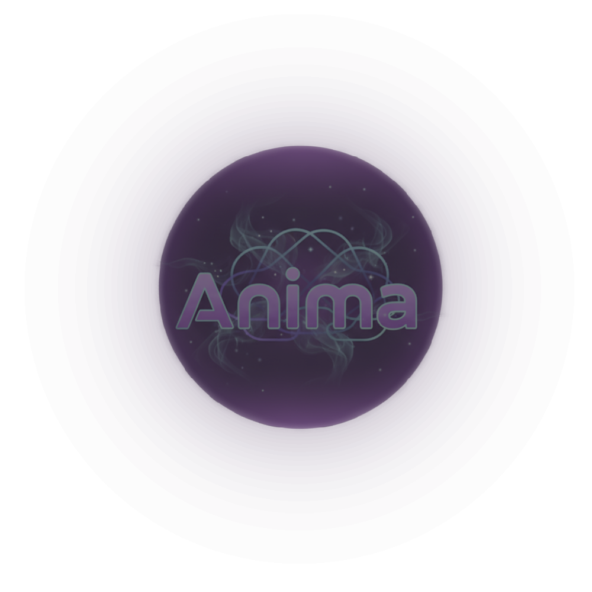

# Anima

Anima is a **100% local** AI companion (Rust + Flutter) designed to chat, remember, and evolve with you without relying on cloud services.

Its goal is not only to answer messages, but to build long-term personal continuity through:
- contextual memory (RAG),
- cognitive consolidation (Sleep Cycle),
- persistent user profile,
- and full local data control.

## What is this project?

Anima combines a Flutter app (UX, onboarding, chat, settings) with a Rust core (local inference, semantic memory, consolidation, and SQLite persistence). Frontend and backend communicate through flutter_rust_bridge.

Core principle: **your context and identity stay local**.

---

## Current state (V1)

- Local chat with token-by-token streaming.
- Persistent history and vector memory.
- Semantic retrieval of relevant context (RAG).
- Sleep Cycle consolidation into profile_traits.
- Advanced onboarding with language selector (wheel + more menu).
- Premium dark UI inspired by the web visual language.
- Full factory reset (double confirmation).
- Local database export.

---

## Visual identity

### Anima.ai (web vision)



### App identity



---

## Architecture at a glance

| Layer | Technology |
|---|---|
| Frontend | Flutter |
| Backend | Rust |
| Bridge | flutter_rust_bridge v2 |
| Local inference | llama.cpp + GGUF models |
| Persistence | SQLite |

### Main flow

1. User sends a message.
2. Rust stores the message and generates an embedding.
3. Similar memories are retrieved through cosine similarity.
4. Prompt is built with context + profile + language.
5. Model generates response (sync or streaming).
6. Final response and derived memory are persisted.

---

## Languages

Anima supports language selection and normalization in frontend and backend prompt steering.

Currently supported language codes:
ES, EN, CH, AR, RU, JP, DE, FR, HI, PT, BN, UR, ID, KO, VI, IT, TR, TA, TH, PL.

---

## Requirements

- Flutter SDK
- Rust toolchain (rustup, cargo)
- GGUF models in models/
  - chat model (example: models/anima_v1.gguf)
  - embedding model (example: models/all-MiniLM-L6-v2.gguf)

Optional (desktop):

```bash
flutter config --enable-windows-desktop
flutter config --enable-macos-desktop
flutter config --enable-linux-desktop
```

---

## Run locally

```bash
cd frontend
flutter pub get
flutter run -d windows
```

For macOS/Linux, use -d macos or -d linux.

---

## Change model

1. Place your model in models/.
2. Update paths in frontend/lib/services/anima_service.dart (chatModelPath, embeddingModelPath).
3. Restart the app.

---

## Repository structure

```
frontend/
  lib/
    screens/
    services/
    widgets/
  rust/
    src/
      api/
      ai.rs
      db.rs
docs/
  API.md
  ARCHITECTURE.md
  IMPLEMENTATION_GUIDE.md
  ROADMAP.md
  database/SCHEMA.md
```

---

## Documentation index

- Architecture: docs/ARCHITECTURE.md
- FRB API: docs/API.md
- Implementation guide: docs/IMPLEMENTATION_GUIDE.md
- Roadmap: docs/ROADMAP.md
- DB schema: docs/database/SCHEMA.md
- Executive summary: PROJECT_SUMMARY.md

---

## License

MIT
