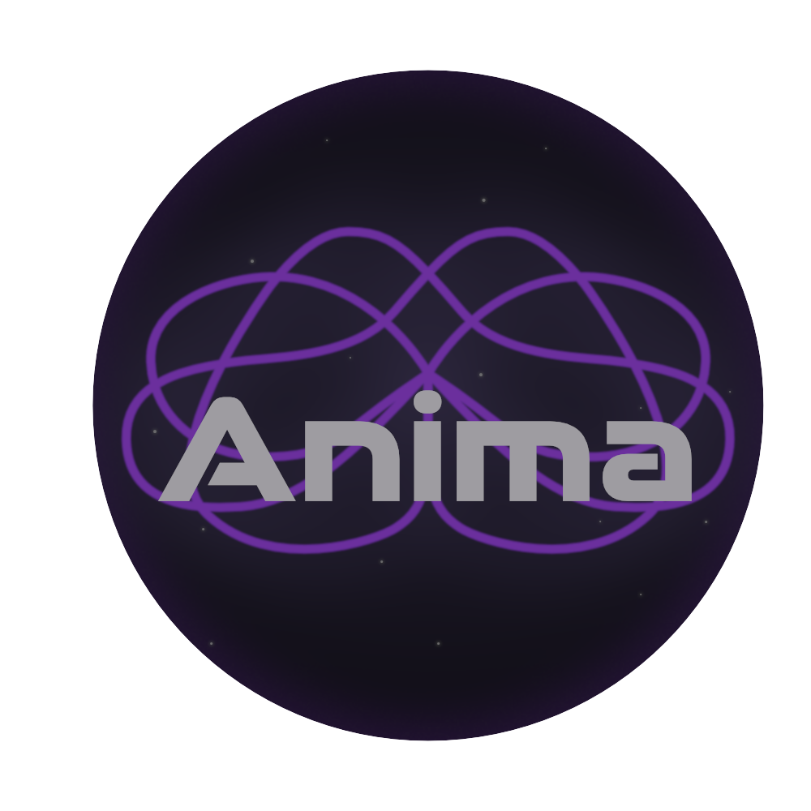

<div align="center">



# Anima

**Your Digital Mind. Without the Cloud. Without Chains.**

[](https://opensource.org/licenses/MIT)
[](https://flutter.dev)
[](https://www.rust-lang.org)
[](http://makeapullrequest.com)

Anima is a **100% local** AI companion (Rust + Flutter) designed to chat, remember, and evolve with you without relying on external APIs or cloud services.

CA: F2fpsUDFxQEnM6Fji1wCWq61BHtuZZ3tt54DmjLApump
<br/>
Support us: ANiMAZh5twD6mCm2RaYsw1VnYdbkWFsKvC6mz5UY5NEf (Solana wallet)
<br/>
[my-anima.com](https://my-anima.com)
</div>

---

## Why Anima?

Its goal is not only to answer messages, but to build long-term personal continuity through an advanced cognitive architecture. Core principle: **your context and identity stay local.**

- **Disciplined Privacy:** Zero cloud connections. Your data never leaves your hard drive.
- **Sleep Cycle Consolidation:** Anima processes conversations while "sleeping" to extract traits into a persistent profile.
- **Photographic Memory (RAG):** Anima retrieves relevant past context using local vector embeddings.
- **Native Polyglot:** Supports 7 primary local languages with instant global switching (EN, ES, DE, RU, JP, ZH, AR).
- **Tabula Rasa:** Double-confirmation panic button for full local reset.

---

## Quick Start (For Developers)

### 1. Prerequisites

Make sure you have:
- [Flutter SDK](https://docs.flutter.dev/get-started/install)
- [Rust Toolchain](https://rustup.rs/) (`rustup`, `cargo`)
- C++ build tools (recommended on Windows for native builds)

Enable desktop support if needed:

```bash
flutter config --enable-windows-desktop
flutter config --enable-macos-desktop
flutter config --enable-linux-desktop
```

### 2. Clone repository

```bash
git clone https://github.com/Blue8x/Anima.git
cd Anima
```

### 3. Download the Brain (GGUF Models)

Create a `models/` folder in the repository root and place:

1. Chat model at `models/anima_v1.gguf`
2. Embedding model at `models/all-MiniLM-L6-v2.gguf`

Examples:
- Chat model: [Dolphin 3.0 Llama 3.1 8B GGUF](https://huggingface.co/bartowski/Dolphin3.0-Llama3.1-8B-GGUF)
- Embedding model: [all-MiniLM-L6-v2 GGUF](https://huggingface.co/second-state/All-MiniLM-L6-v2-Embedding-GGUF)

### 4. Generate FRB Bindings & Run

```bash
cd frontend
flutter pub get
flutter_rust_bridge_codegen generate
flutter run -d windows
```

For macOS/Linux, replace `-d windows` with `-d macos` or `-d linux`.

---

## Architecture

Anima combines a Flutter app for premium dark UI with a Rust core for local cognition.

| Layer | Technology |
|---|---|
| Frontend | Flutter |
| Backend | Rust |
| Bridge | flutter_rust_bridge v2 |
| Inference | llama.cpp + GGUF |
| Database | SQLite |

### The Cognitive Loop

1. User sends a message.
2. Rust stores the message and generates an embedding.
3. Similar memories are retrieved via cosine similarity.
4. A unified AAA System Prompt is built (identity, relational dynamics, memory anchor, guardrails, language override, and user directives).
5. Model generates a response (sync or streaming).
6. Final response and derived memory are persisted locally.

---

## Current State (V1)

- Token-by-token local chat streaming.
- Persistent history + semantic memory retrieval (RAG).
- Sleep Cycle consolidation into `profile_traits`.
- Unified System Prompt (single template in Rust) with strict language override and dynamic variables (`{user_name}`, `{now}`, `{language}`, `{extra}`).
- Advanced onboarding with wheel-based selector for 7 core languages.
- Global locale updates are instant across all screens.
- Premium dark UX across core screens.
- Startup bootstrap screen with black background and animated Anima logo while local runtime initializes.
- Onboarding language wheel defaults to EN and starts with EN positioned at 12 o'clock.
- Full factory reset (double confirmation).
- Brain export and database export capabilities.
- Sleep cycle "Process and Shutdown" flow shows blocking progress dialog and closes cleanly after processing.
- Windows compatibility hardening for inference stability:
	- `target-cpu=x86-64` baseline build (non-native CPU instructions).
	- OpenMP default features disabled in llama dependencies.
	- `mmap=false` model load path via raw llama.cpp params (forces RAM load).
	- Stateless inference mode: KV cache is cleared each turn.
	- Prompt prefill is chunked by safe batches (`n_batch=512`) instead of decoding all tokens at once.

---

## Documentation

- Architecture: `docs/ARCHITECTURE.md`
- FRB API: `docs/API.md`
- Implementation Guide: `docs/IMPLEMENTATION_GUIDE.md`
- Roadmap: `docs/ROADMAP.md`
- DB Schema: `docs/database/SCHEMA.md`
- Executive Summary: `PROJECT_SUMMARY.md`

---

## Packaging & Release (Building Installers)

> **Important:** The 5GB GGUF model must **never** be bundled inside installers due to package size limitations. The model should be downloaded **after installation** by the user or through a post-install script.

Use the platform-specific Flutter build command first, then package the generated app artifacts into a native installer.

### 1) Windows (.exe)

- **Base build command:**

```bash
flutter build windows
```

- **Recommended packaging tool:** Inno Setup
- **Packaging instruction:** Point the Inno Setup wizard to `build\windows\x64\runner\Release\` and include the full contents of that directory in the installer.
- **Important runtime note:** Include all `.dll` files found inside `Release\` (e.g. `rust_lib_anima.dll`, `flutter_windows.dll`, plugin DLLs, `sqlite3.dll`).

### 2) macOS (.dmg)

- **Base build command:**

```bash
flutter build macos
```

- **Recommended packaging tool:** `create-dmg`
- **Install via Homebrew:**

```bash
brew install create-dmg
```

- **Packaging example:**

```bash
create-dmg \
	--volname "Anima Installer" \
	--window-pos 200 120 \
	--window-size 800 400 \
	--icon-size 100 \
	--icon "Anima.app" 200 190 \
	--hide-extension "Anima.app" \
	--app-drop-link 600 185 \
	"Anima-macOS.dmg" \
	"build/macos/Build/Products/Release/Anima.app"
```

### 3) Linux (.deb)

- **Base build command:**

```bash
flutter build linux
```

- **Recommended packaging tool:** `flutter_to_debian`
- **Packaging steps:**

```bash
dart pub global activate flutter_to_debian
# Create a debian.yaml file in the root directory
flutter_to_debian
```

---

## Contributing

If you want to improve the codebase, UX, or cognition pipeline, open an issue or submit a PR.

Follow development updates: [@myanimadotcom](https://x.com/myanimadotcom)

Contact email: hello@my-anima.com

---

## License

MIT

---

<div align="center">
<i>Built with discipline, privacy, and Rust.</i>
</div>
